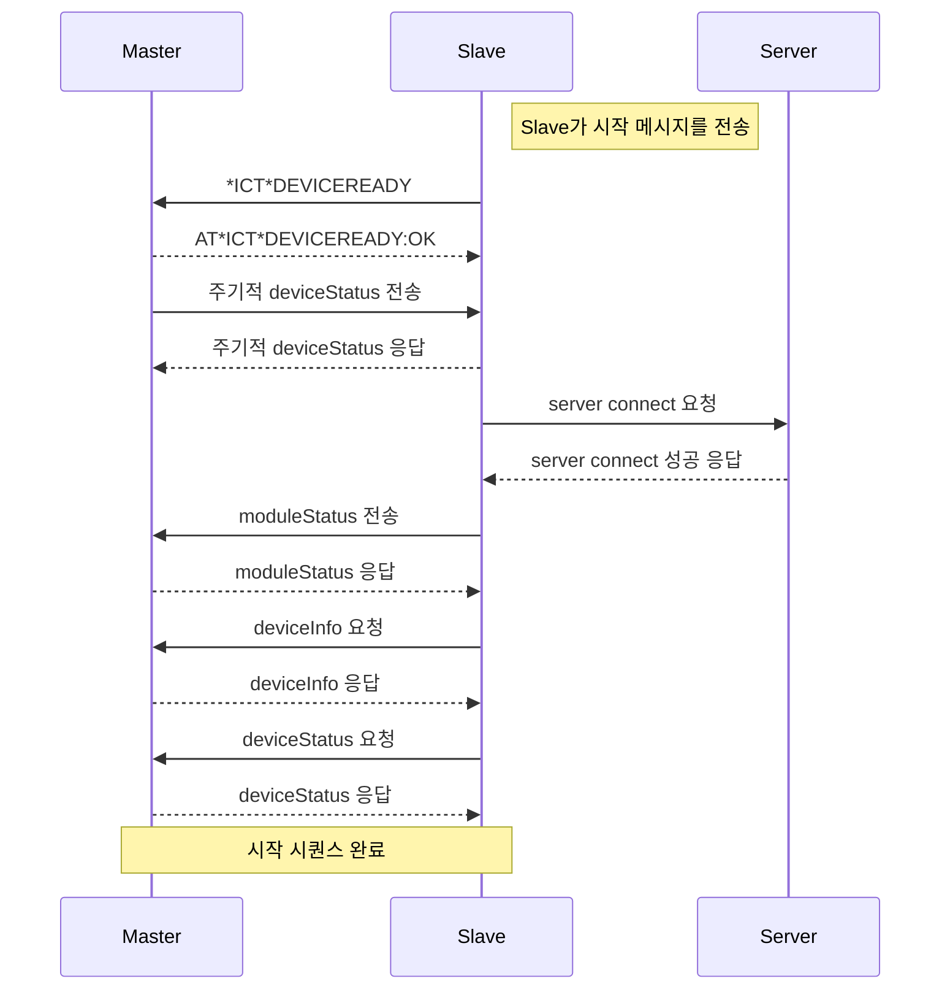

# Himpel IoT Module AT COMMAND 메시지 규격

- # 준비
  - ### UART Config
    | 항목       | 설정값       |
    |------------|--------------|
    | Baudrate   | 115200       |
    | Stop Bits  | Stop Bit 1   |
    | Data Bits  | 8 Bit        |
    | Flow Ctrl  | Disable      |


- # AT COMMAND 규칙
  - ## 메시지 필드
  - ### prefix
    | prefix | 설명       |
    |------|------------|
    | AT\*ICT\*   | Master 발신  |
    | \*ICT\*  | Slave 발신  |
    
  - ### Command
    | 명령어       | 주체              | 설명                                              |
    |--------------|-------------------|---------------------------------------------------|
    | DEVICEREADY  | Slave             | 연동 준비가 완료되었음을 알림                    |
    | FACRESET     | Master            | 모듈을 공장초기화하고, onboarding 상태로 진입     |
    | ONBOARD      | Master            | 모듈이 onboarding 상태로 진입                    |
    | REQ          | Master / Slave    | 정보 요청, body는 JSON으로 정의                  |
    | SET          | Master / Slave    | 정보 설정, body는 JSON으로 정의                  |
    | RESP         | Master / Slave    | 정보 요청/설정에 대한 응답, body가 있으면 JSON으로 정의 |
    

  - ### Response
    | 코드 | 설명       |
    |------|------------|
    | OK   | 성공 응답  |
    | NOK  | 실패 응답  |

  - ### Body
    - 발신측의 Command 가 REQ, SET , RESP 인 경우 json 형태의 body 를 포함한다
  - ### CRLF
    - 모든 데이터의 마지막 데이터 ( Checksum 이전 ) 에 반드시 CRLF ( 0x0D, 0x0A ) 를 포함한다.
  - ### Checksum
    - 메시지기 첫 prefix 부터 body 까지의 모든 데이터를 Add
 
  - ## 메시지 포맷
  - ### 요청
    <pre>
    ┌────────┬──────────┬───────────────┬──────────────────────┬────────┬────────────┐
    │ Prefix │ Command  │ Delimiter " " │        Body?         │  CRLF  │  Checksum  │
    └────────┴──────────┴───────────────┴──────────────────────┴────────┴────────────┘
    </pre>

  - ### 응답
    <pre>
    ┌────────┬──────────┬───────────────┬───---------┬───────────────┬───────────────┬────────┬────────────┐
    │ Prefix │ Command  │ Delimiter ":" │  Response  │ Delimiter " " │     Body?     │  CRLF  │  Checksum  │
    └────────┴──────────┴───────────────┴───---------┴───────────────┴───────────────┴────────┴────────────┘
    </pre>

- # 연동 시작 Sequence
  ### 🔄 시작 시퀀스 다이어그램



- # 연동 규격
  
  - ## 시작
    - Slave 가 통신 가능한 상태임을 알림
    - Slave 는 본 메시지에 대한 Master 측의 응답이 없을 경우 3초 주기로 질의하며. 응답 수신시 즉시 멈춤.
    - 발신 주체 : Slave
    - 요청 ( Slave )
    ```
      *ICT*DEVICEREADY
    ```
    - 응답 ( Mater )
    ```
      AT*ICT*DEVICEREADY:OK
    ```


  - ## Master 의 정보 요청
    - Slave 가 Master 의 정보를 요청
    - Slave 부팅시 1회, on boarding 시 장치 등록할때 1회 요청 할 수 있음
    - Master 가 Sub Device 를 관리하는 경우를 대비하여, 응답은 json array 로 하고, 관리하지 않는 경우에도 array 에 하나만 추가하여 응답해야 함
    - 발신 주체 : Slave
    - 요청 ( Slave )
    ```
      *ICT*REQ {
        "cmd":"deviceInfo"
      }
    ```
    - 응답 ( Mater )
    ```
      AT*ICT*RESP:OK {
        "deviceInfo":
        [
          {
            "id":"deviceId1",
            "modelName":"Huevenco5",
            "deviceFirmwareVersion":"1.0",
            "hierarchy":"main",
            "telemetryPeriodic":"30",
            "sensor":["temperature","humidity","voc","co2","pm25","pm10"],
            "control":["power","airVolume","mode"],
            "monitor":["filter","current"]
          },
          {
            "id":"deviceId2",
            "modelName":"Huevenco5",
            "deviceFirmwareVersion":"1.0",
            "hierarchy":"sub",
            "sensor":["temperature","humidity","voc","co2"],
            "control":["power"],
            "monitor":[]
          }
        ]
      }
    ```


  - ## Master 의 현재 상태 정보 요청
    - Slave 가 Master 의 현재 상태 정보를 요청
    - Slave 부팅시 1회, on boarding 시 장치 등록할때 1회 요청 할 수 있음
    - Master 가 Sub Device 를 관리하는 경우를 대비하여, 응답은 json array 로 하고, 관리하지 않는 경우에도 array 에 하나만 추가하여 응답해야 함
    - 발신 주체 : Slave
    - 요청 ( Slave )
    ```
      *ICT*REQ {
        "cmd":"deviceStatus"
      }
    ```
    - 응답 ( Mater )
    ```
      AT*ICT*RESP:OK {
        "deviceStatus":
        [
          {
            "id":"deviceId1",
            "temperature":"20",
            "humidity":"40",
            "voc":"1000",
            "co2":"400",
            "pm25":"3",
            "pm10":"7",
            "power":"on",
            "airVolume":"1",
            "mode":"auto",
            "filter":"34",
            "current":"22"
          },
          {
            "id":"deviceId2",
            "temperature":"20",
            "humidity":"40",
            "voc":"1000",
            "co2":"400",
            "pm25":"3",
            "pm10":"7",
            "power":"on"
          }
        ]
      }
    ```
  


  - ## Master 의 주기적 (telemetryPeriodic) Telemetry 데이터 전송
    - Master 의 Sensor 데이터를 주기적으로 전송
    - Master 는 Slave 와 통신 가능 상태 알림 Message (*ICT*DEVICEREADY) 를 서로 나누었으면, 주기적으로 sensor data 를 Slave 로 전송, Slave 의 서버 통신 여부와 무관하게 전송 필요
    - 발신 주체 : Master
    - 요청 ( Master )
    ```
      AT*ICT*SET {
        "cmd":"deviceStatus",
        "deviceStatus":
        [
          {
            "id":"deviceId1",
            "power":"on",
            "airVolume":"1",
          },
          {
            "id":"deviceId2",
            "power":"on",
          }
        ]
      }
    ```
    - 응답 ( Slave )
    ```
      *ICT*RESP:OK
    ```


  - ## Master 의 control event 전송
    - Master 장치에서 사용자가 제어할 경우 control 상태를 Slave 로 전송
    - 변경된 상태만 전송
    - 발신 주체 : Master
    - 요청 ( Master )
    ```
      AT*ICT*SET {
        "cmd":"deviceStatus",
        "deviceStatus":
        [
          {
            "id":"deviceId1",
            "temperature":"20",
            "humidity":"40",
            "voc":"1000",
            "co2":"400",
            "pm25":"3",
            "pm10":"7",
          },
          {
            "id":"deviceId2",
            "temperature":"20",
            "humidity":"40",
            "voc":"1000",
            "co2":"400",
            "pm25":"3",
            "pm10":"7",
          }
        ]
      }
    ```
    - 응답 ( Slave )
    ```
      *ICT*RESP:OK
    ```

  - ## Master 로 제어 요청 전송
    - Master 로 제어 요청
    - 발신 주체 : Slave
    - 요청 ( Slave )
    ```
      *ICT*SET {
        "cmd":"deviceStatus",
        "deviceStatus":
        [
          {
            "id":"deviceId1",
            "power":"on",
            "airVolume":"1",
          },
          {
            "id":"deviceId2",
            "power":"on",
          }
        ]
      }
    ```
    - 응답 ( Slave )
    ```
      AT*ICT*RESP:OK
    ```


  - ## Slave 의 on boarding 상태 진입 명령
    - 장치등록이 필요 할 경우 Master 는 Slave 로 on boarding 상태 진입 ( 장치 등록 살태 ) 명령 전송 )
    - 발신 주체 : Master
    - 요청 ( Master )
    ```
      AT*ICT*ONBOARDING
    ```
    - 응답 ( Slave )
    ```
      *ICT*ONBOARDING:OK
    ```


  - ## Slave 의 현재 동작 상태 전송
    - Slave 의 동작 상태가 변경될 경우 Master 에 알림
    - 발신 주체 : Slave
    - 요청 ( Slave )
    ```
      *ICT*SET {
        "cmd":"moduleStatus",
        "moduleStatus":"idle"
      }
    
    ```
    - 응답 ( Mater )
    ```
      *ICT*RESP:OK
    ```
    - Parameter
    <table>
      <tr>
        <th rowspan="3">moduleStatus</th>
        <td>idle</td>
        <td>idle 상태</td>
      </tr>
      <tr>
        <td>iotConnected</td>
        <td>서버에 접속 완료 상태</td>
      </tr>
      <tr>
        <td>onboarding</td>
        <td>장치 등록 상태</td>
      </tr>
     </table>


   - ## Master 로 방정보 전송
      - Mobile 에서 설정한 방정보를 Master 로 전송
      - 발신 주체 : Slave
      - 요청 ( Slave )
      ```
        *ICT*SET {
          "id":"deviceId1",
          "cmd":"roomName",
          "roomName":"거실"
        }
      
      ```
      - 응답 ( Mater )
      ```
        *ICT*RESP:OK
      ```


   - ## Master 로 스케쥴 추가/수정/삭제 정보 전송
      - Mobile 에서 설정한 방정보를 Master 로 전송
      - 발신 주체 : Slave
      - 요청 ( Slave )
      ```
        *ICT*SET {
          "id":"deviceId1",
          "cmd":"schedule",
          "schedule":{
            "id":"1",
            "method":"set",
            "week":[1,0,0,1,0,1,0],
            "repeat":"true",
            "time":"10:00",
            "meridiem":"AM",
            "control":{
              "power":"on",
              "mode":"auto",
            }
          },
        }
      
      ```
      - 응답 ( Mater )
      ```
        *ICT*RESP:OK
      ```
      - Parameter
      <table>
        <tr>
          <th rowspan="2">method</th>
          <td>set</td>
          <td>추가및 수정</td>
        </tr>
        <tr>
          <td>del</td>
          <td>삭제</td>
        </tr>
       </table>
      <table>
        <tr>
          <th rowspan="7">week</th>
          <td>0</td>
          <td>일</td>
        </tr>
        <tr>
          <td>1</td>
          <td>월</td>
        </tr>
        <tr>
          <td>2</td>
          <td>화</td>
        </tr>
        <tr>
          <td>3</td>
          <td>수</td>
        </tr>
        <tr>
          <td>4</td>
          <td>목</td>
        </tr>
        <tr>
          <td>5</td>
          <td>금</td>
        </tr>
        <tr>
          <td>6</td>
          <td>토</td>
        </tr>
  
      </table>

  - ## Master 의 Telemetry History 데이터 요청
    - Master 는 필요한 구간의 히스토리 데이터를 Slave 요청.
    - startTime, endTime TimeStamp 는 ms 단위
    - intervalType 은 분단위 : "min" , 일단위 "day"
    - interval 은 intervalType "min" 일 경우 분 입력, "day" 일 경우 일 입력 
    - 발신 주체 : Master
    - 요청 ( Master )
      ```
        *ICT*REQ {
          "cmd":"telemetryHistory",
          "telemetryHistory":{
            "id":"deviceId1",
            "startTime":1748179842000,
            "endTime":1748201442000,
            "key":"co2",
            "intervalType":"min",
            "interval":15,
            "agg":"AVG",
            "ts_drop":true
          },
        }
      
      ```
      - 응답 ( Slave )
      ```
        *ICT*RESP:OK {
          "cmd":"telemetryHistory",
          "telemetryHistory": {
            "id":"deviceId1",
            "co2": [
            {
              ts": 1748180292000,
              "value": 794.370786516854
            },
            {
              "ts": 1748188392000,
              "value": 873.2488888888889
            },
            {
              "ts": 1748189292000,
              "value": 885.2616487455197
            }
          ]
        }
      }
      ```

  - ## Slave 의 Weather 데이터 전송
    - Slave 는 부팅, WiFi 연결 즉시 공공데이터 API 를 사용하여 위치기반 날씨 정보를 수신하여, Master 로 전송
    - 발신 주체 : Slave
    - 요청 ( Slave )
      ```
        *ICT*SET {
          "cmd": "weather",
          "weather": [
            {
              "fcstTime": "0600",
              "SKY": "1",
              "TMP": "12",
              "TMN": "1",
              "TMX": "13"
            },
            ...
          ]
        }

      
      ```
      - 응답 ( Master )
      ```
        *ICT*RESP:OK
      ```

  - ## Slave 의 시간정보 전송
    - Slave 는 부팅, WiFi 연결, SNTP Sync 즉시 현재 시간을 Master 로 전송
    - 발신 주체 : Slave
    - 요청 ( Slave )
      ```
        *ICT*SET {
          "cmd": "time",
          "time": 1748272791
        }

      
      ```
      - 응답 ( Master )
      ```
        *ICT*RESP:OK
      ```


    


